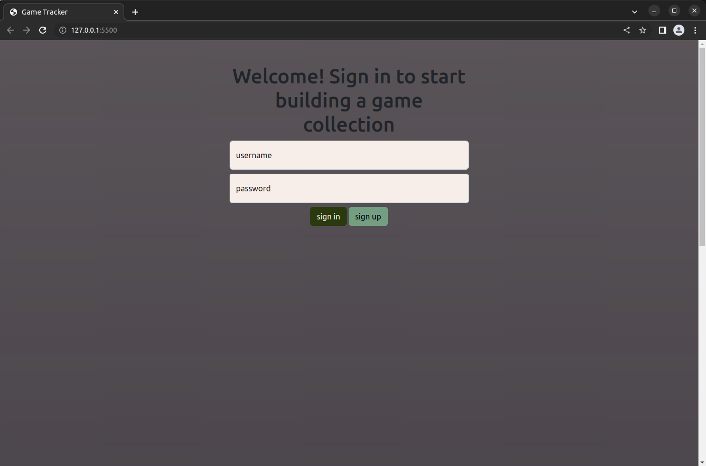
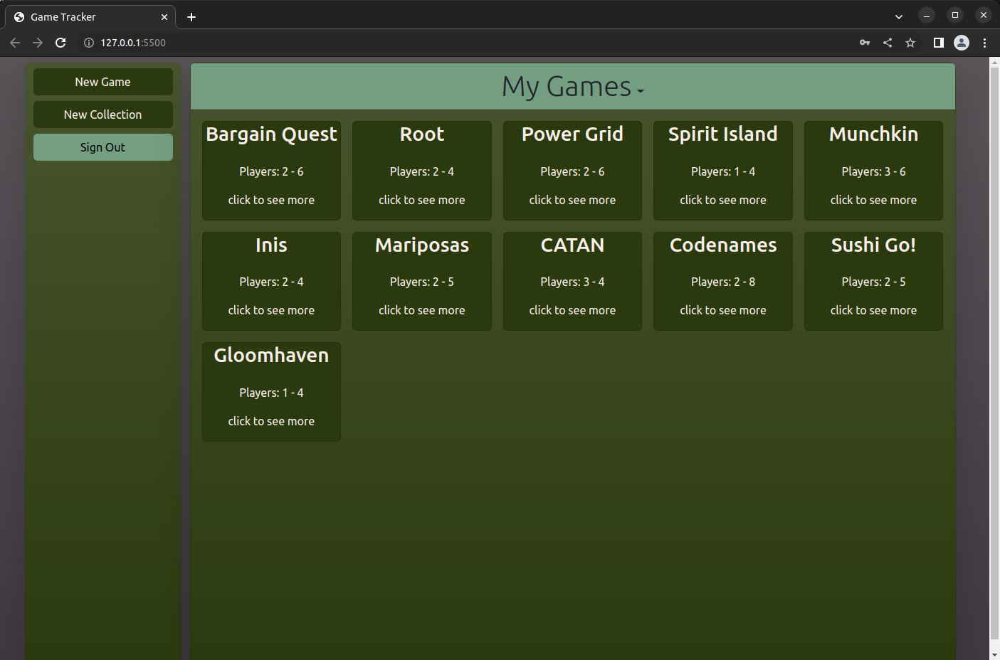
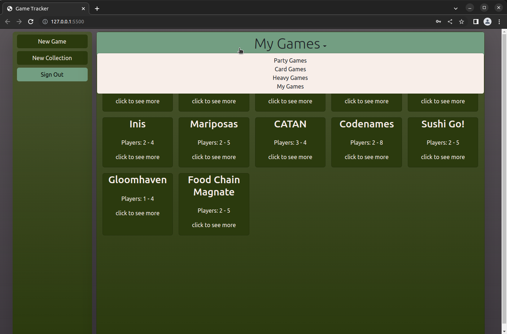
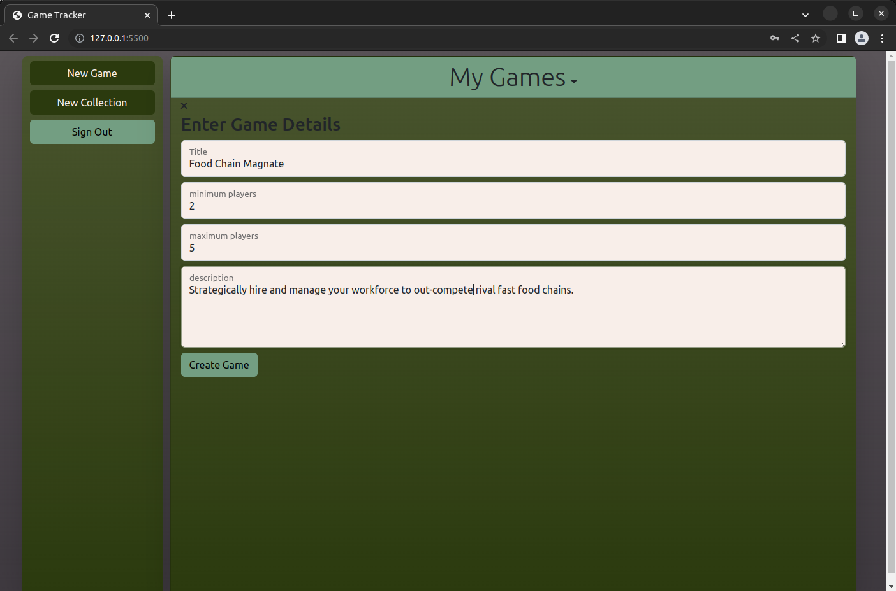
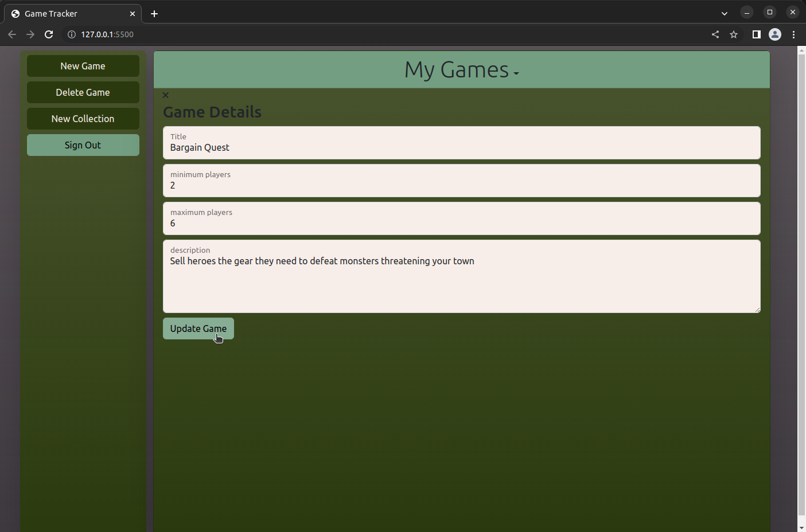

# Game Tracker

Game Tracker is a quick way to make a digital copy of your boardgame collection (or whatever kinds of games you like, I won't tell). Accessible anywhere you go, this digital library of games is essential when planning boardgame nights and is an easy way to show off your collection to friends.

# Getting Started

The app is hosted on GitHub Pages [check it out!](https://scottank.github.io/game-tracker-client/)

_sorry, due to hosting issues for the backend server, the app is currently not availabe. This should be resolved shortly. Until then you, can host your own server if you really want to see Game Tracker in action. Here's the repository https://github.com/ScottAnk/game-tracker-server_

Grab a username and you're off to the races. If you're feeling lost, check out the interface section for a walkthrough.

# Technologies

Game Tracker is built with the following tools:

- HTML
- CSS (Bootstrap)
- JavaScript
- Sass

HTML and Bootstrap make up the user interface, with all the interactivity controlled through JavaScript. Sass is used to customize the Bootstrap color theme.

# Interface

Game Tracker is primarily intended for personal collections, so you are required to make an account before getting started. I don't want your personal info, so accounts are tied to usernames instead of emails.  

After logging in you're immediately greeted with a tiled view of all your games. The controls to create new games and collections are accessible in the panel on the left side of the screen. These controls are accessible everywhere in the app.  

This homepage is the My Games collection which contains all of the games in your library. Games can be organized into sub collections, which are accessible from the dropdown menu at the top of the page.  

Click the New Game button to open this game creation view. Games are automatically added to the current collection as well as your My Games collection.  

Click any of the game tiles to see the game's description and modify any details on this familiar feeling interface.  

# Next Steps

Game Tracker is between it's MVP and Version 2 milestones. The user stories below lay out the future plans for Game Tracker, and are organized roughly in order of priority.

## Version 2

- As a user I need to be able to share a read-only link to my collections so I can show my collection to friends
- As a user I need to be able to access read-only links without signing in so that my friends don't need an account to see my collection

## Version 3

- As a user I need to be able to search a list of pre-defined games because I don't want to define all my games myself
- As a user I need to be able to add cover pictures to games
- As a user I need to be able to add session notes to each game
